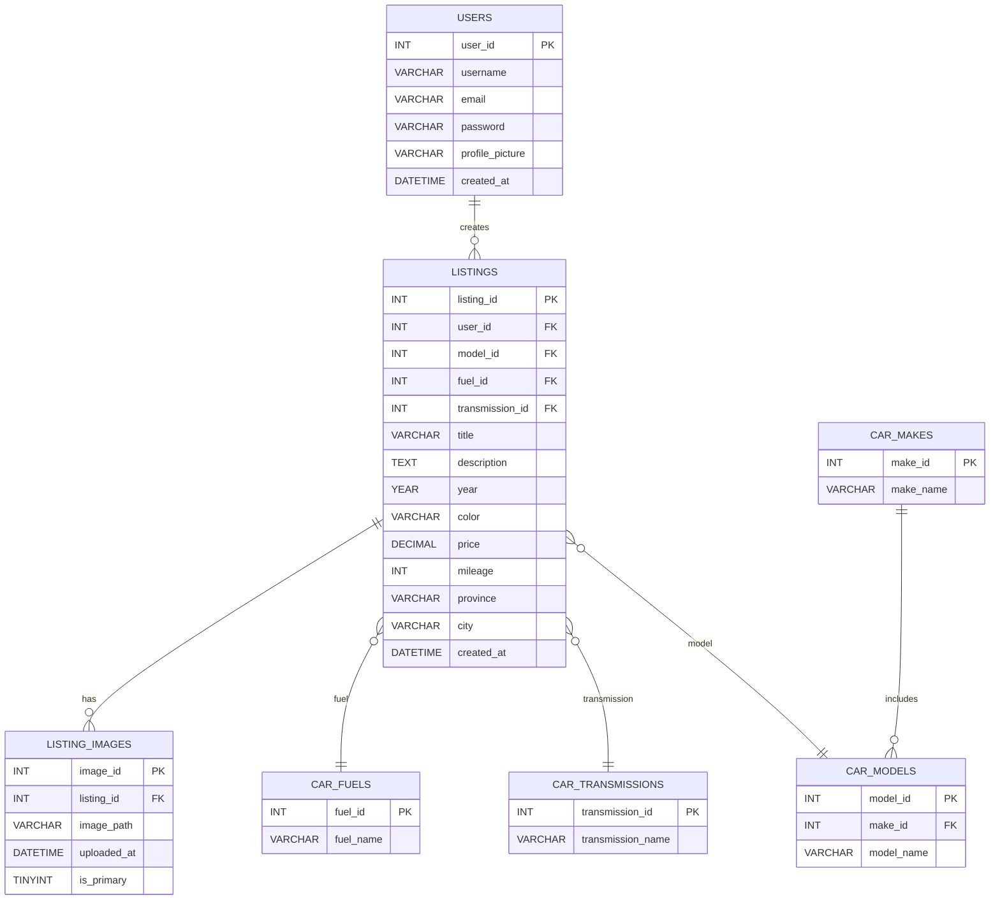

```mermaid
erDiagram
    USERS ||--o{ LISTINGS : "creates"
    LISTINGS ||--o{ LISTING_IMAGES : "has"
    LISTINGS }o--|| CAR_FUELS : "fuel"
    LISTINGS }o--|| CAR_TRANSMISSIONS : "transmission"
    LISTINGS }o--|| CAR_MODELS : "model"
    CAR_MAKES ||--o{ CAR_MODELS : "includes"
    
    USERS {
        INT user_id PK
        VARCHAR username
        VARCHAR email
        VARCHAR password
        VARCHAR profile_picture
        DATETIME created_at
    }

    CAR_MAKES {
        INT make_id PK
        VARCHAR make_name
    }

    CAR_MODELS {
        INT model_id PK
        INT make_id FK
        VARCHAR model_name
    }

    CAR_FUELS {
        INT fuel_id PK
        VARCHAR fuel_name
    }

    CAR_TRANSMISSIONS {
        INT transmission_id PK
        VARCHAR transmission_name
    }

    LISTINGS {
        INT listing_id PK
        INT user_id FK
        INT model_id FK
        INT fuel_id FK
        INT transmission_id FK
        VARCHAR title
        TEXT description
        YEAR year
        VARCHAR color
        DECIMAL price
        INT mileage
        VARCHAR province
        VARCHAR city
        DATETIME created_at
    }

    LISTING_IMAGES {
        INT image_id PK
        INT listing_id FK
        VARCHAR image_path
        DATETIME uploaded_at
        TINYINT is_primary
    }
```
